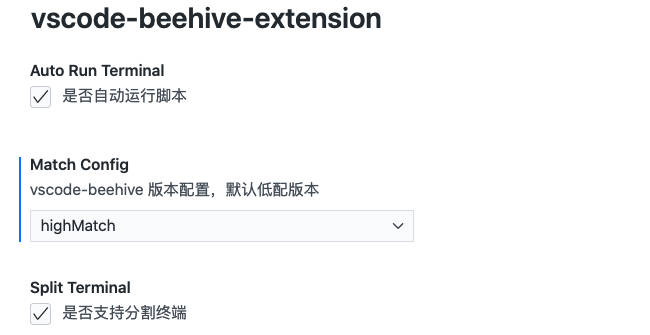

  
  <h1>Welcome to the vscode-beehive-extension repository</h1>
  <strong>Improve your efficiency, release your hands ✍️ </strong>
  <h6>Made with ❤️ by sugarTurboS for developers</h6>

 

  
  
  
  
  
  

# 背景

项目组中，每个人对于启动命令、打包命令等各有各自的“规范”，到底叫 `npm run dev` 还是叫 `npm run start` 才是合理？在跨项目之间切换，常常要去阅读 `README.md` 文档，甚至于无文档的情况下，需要去查看 `package.json` 文件，且还需要手动输入脚本命令，为此，SugarTurboS 为了统一大家的规范，各项目都保持一致的命令规则，同时提高效率，开发更加简洁方便，推出 `beehive` 插件～

# 目的

SugarTurboS 开发针对项目命令规范及脚本运行的辅助工具～

我们的目的是：

- 统一规范，各项目都保持一致的命令规则
- 提高效率，开发更加简洁方便，从而释放你的双手

# 脚本规范约束

该插件会读取 `package.json` 下的 `scripts` 字段，为此需要约束好脚本命令：

### 🎉 webpack dev server 相关

- npm run webpack:dev
- npm run webpack:prod
- ...

### 🚗 egg server 相关

- npm run server:dev
- npm run server:test
- npm run server:test-1
- npm run server:test-2
- npm run server:prod
- ...

### install 安装相关（暂未支持）

- npm run install

### 打包相关 （暂未支持）

- npm run build

### ESLint 相关（暂未支持）

检测：

- npm run lint [--type]
- npm run lint-warning
- 0npm run lint-error

修复：

- npm run lint [--type] [–fix]
- npm run lint-error-fix

# 首选项配置

下面说明一下版本配置～

### 低配

- 自动进入项目目录
- 复制脚本命令至剪切板
- 灵活使用，可自行在外部终端粘贴运行

### 中配

- 自动打开 vscode 终端
- 自动跳转当前项目，填充脚本
- 默认不自动运行脚本内容

### 高配

- 自动打开 vscode 终端
- 自动跳转当前项目，填充脚本
- 自动运行脚本内容
- 支持终端拆分(分屏)、多项目终端切换

# 贡献力量

> 目前版本仅支持 webpack dev server 与 egg server 运行，关于 instal、build、eslint 已列入计划～更多请提 PR

👉 [前往提 PR](https://github.com/SugarTurboS/vscode-beehive-extension)

👉 [阅读源码](https://github.com/SugarTurboS/vscode-beehive-extension)

👉 [学习vscode插件](https://github.com/PDKSophia/learn-vscode-extension)