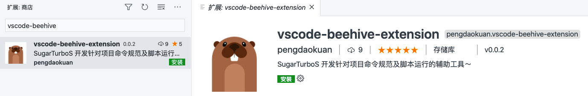
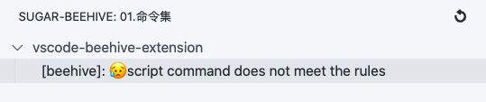
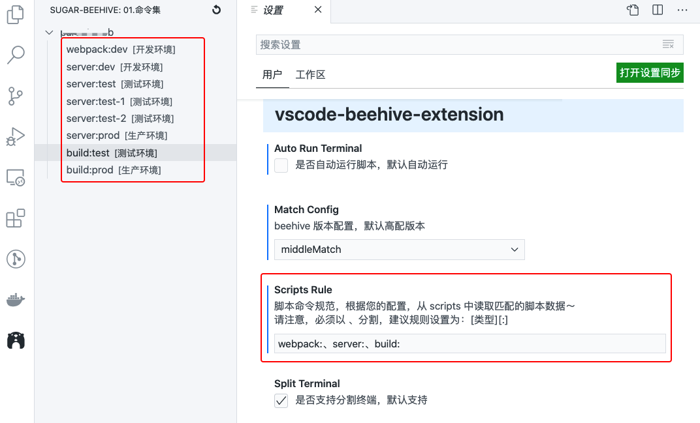
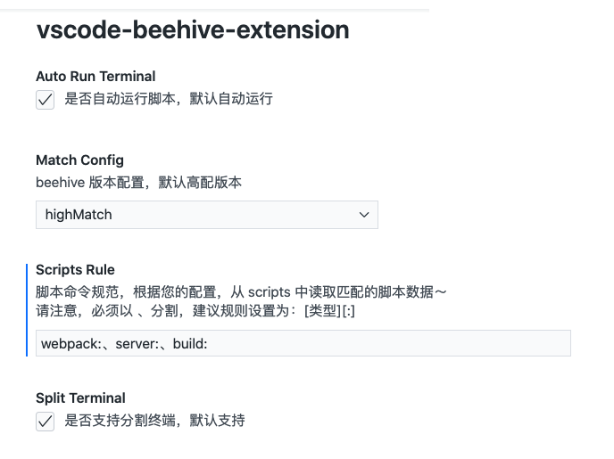
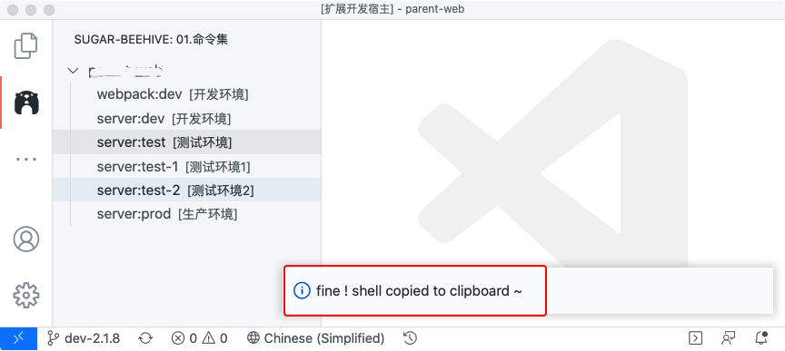
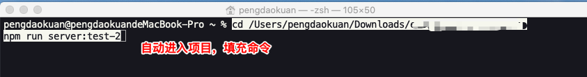
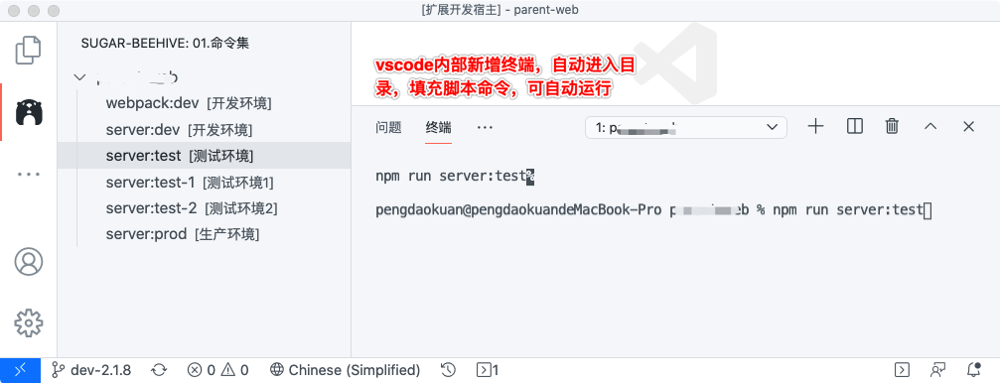
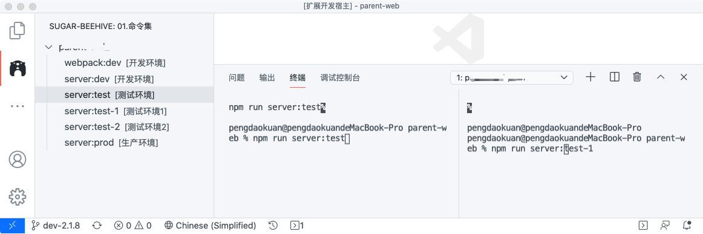

# vscode-beehive-extension

✍️ Improve your efficiency, release your hands

<a href="https://github.com/SugarTurboS/vscode-beehive-extension">
  
</a>
<a href="https://github.com/PDKSophia">
  
</a>
<a href="https://github.com/SugarTurboS/Blogs">
  
</a>
<a href="https://juejin.im/user/3526889001458910">
  
</a>
<a href="https://github.com/SugarTurboS">
  
</a>
<a href="https://github.com/SugarTurboS/Sugar-Community/blob/master/LICENSE">
  
</a>
<br />

# 🐒 前言

前段时间，被秘密委任组内 vscode 插件开发小分队的特派员，因第一次开发 vscode 插件，直接肛文档实在是“痛苦”，在翻阅了部分文章和阅读原英文文档之后，为了后续开发的小伙伴，能够直接上手各种 demo，从而开发符合自己需求的插件，写了 [【KT】vscode 插件开发例子系列（一）](https://juejin.cn/post/6926333952714080264)、[【KT】vscode 插件开发例子系列（二）](https://juejin.cn/post/6932011302055477262)，这次，直接给大家带来最终实战并发布的 [🌈 vscode-beehive-extension](https://marketplace.visualstudio.com/items?itemName=pengdaokuan.vscode-beehive-extension&ssr=false#overview)

# 🚗 背景

为什么会开发这个插件呢？原因是: 在项目组中，每个人对于启动命令、打包命令等各有各自的“规范”，**到底叫 `npm run dev` 还是叫 `npm run start` 才是合理**？在跨项目之间切换，常常要去阅读 `README.md` 文档，甚至于无文档的情况下，需要去查看 `package.json` 文件，且还需要手动输入脚本命令...

于是，**SugarTurboS 召开第 n 届神州路民主评审会议**，会议核心在于：统一大家的规范，各项目都保持一致的命令规则，提高效率，开发更加简洁方便 ～

此次评审会议，委派我为先锋人员，前往调研 vscode 插件的开发～

# 🌈 目的

这是一款针对项目命令规范及脚本运行的辅助工具～

我们的目的是：

- 统一规范，各项目都保持一致的命令规则
- 提高效率，开发更加简洁方便，从而释放你的双手

**只需要通过此插件，在 vscode 侧边栏轻轻一点，自动显示终端并为您运行脚本命令，你不需要记住烦人的启动命令，不需要手动敲下重复的 npm run xxx ～**

## 🐷 如何使用

第一步：环境要求

> vscode 版本要求 v1.42.0 以上

第二步：插件管理中搜索 beehive



第三步：点击安装即可使用

> 会自动读取 package.json 中的 script，按照用户首选项设置的脚本规则，进行读取匹配的脚本，进行展示

正常来说，初次使用此插件的，都会遇到此情况



不要慌，这说明你的脚本并不符合规范，此时你需要前往首选项进行配置

如 vscode 首选项配置: `webpack:、server:、build:`，再统一修改每个项目的 `package.json` 中的命令（保持统一规范）

```json
// 举例说明
{
  "scripts": {
    "webpack:dev": "echo webpack --dev",
    "server:dev": "echo egg server --dev",
    "server:test": "echo egg server --test",
    "server:test-1": "echo egg server --test-1",
    "server:test-2": "echo egg server --test-2",
    "server:prod": "echo egg server --prod",
    "build:test": "echo build --test",
    "build:prod": "echo build --prod"
  }
}
```



第四步：点击左侧的脚本命令，即可自动运行脚本

> 真的好用，不需要记烦人的命令，不需要每次手动输入 npm run xxx ，真香 ！！！

## 🎉 规范约束

**由于该插件会读取 `package.json` 下的 `scripts` 字段，为此我们需要约束好脚本命令，所有规范必须遵循以下规则**：

> 🎉 目前支持用户在首选项配置中自行配置～

> 🙏 请确保一定遵循规则进行配置～

### webpack dev server rule

推荐规范: webpack:[env]-[number]

举例举证: webpack:dev 、webpack:dev-1、webpack:prod、...

### egg server rule

推荐规范: server:[env]-[number]

举例举证: server:dev 、server:dev-1、、server:test、、server:test-1、、server:test-2、、server:prod、...

### build rule

推荐规范: build:[env]-[number]

举例举证: build:test 、build:prod、...

## 🙋‍♂️ 默认配置

插件默认是：高配版，支持分割终端，自动运行脚本



下面说明一下版本配置～

### 低配

- 自动进入项目目录
- 复制脚本命令至剪切板
- 灵活使用，可自行在外部终端粘贴运行

> 点击左侧命令，复制脚本内容



> 可在外部终端粘贴运行



### 中配

- 自动打开 vscode 终端
- 自动跳转当前项目，填充脚本
- 默认不自动运行脚本内容

> 点击左侧命令，新增终端，每点击脚本命令一次，会新增一次终端窗口，且自动填充脚本内容



### 高配

- 自动打开 vscode 终端
- 自动跳转当前项目，填充脚本
- 自动运行脚本内容
- 支持终端拆分(分屏)、多项目终端切换

> 点击左侧命令，自动新增终端，同项目下的脚本会进行终端拆分，且自动填充脚本内容



## 😢 不可使用？

如果插件安装之后不能使用，一般是下面这几种情况：

### 嵌套目录

因为 vscode 提供的 API 只能得到工作区所有根文件夹数组，举个例子

```js
├── A_Folder
│   ├── B_Folder
│   │   ├── D_Folder
│   │   └──
│   │
│   ├── C_Folder
│   └──
└──
```

我们只能得到 A_Folder 的路径，得不到 B、C、D 的路径

所以当你发现插件不工作时，请检查一下，你的工作区文件目录结构

### 命令不存在或命令不符合规范

如果项目的 scripts 不符合规范，或者不存在 scripts 属性，则会给予报错提示，此时你应该修改 scripts 以达到规范目的！！！

# 💪 贡献力量

> 目前版本仅支持 webpack dev server 与 egg server 运行，关于 instal、build、eslint 已列入计划～更多请提 PR

👉 [前往提 PR](https://github.com/SugarTurboS/vscode-beehive-extension)

👉 [阅读源码](https://github.com/SugarTurboS/vscode-beehive-extension)

👉 [学习 vscode 插件](https://github.com/PDKSophia/learn-vscode-extension)

## 最后

功能刚刚发布，可能会有一些 BUG 或缺陷，希望大家可以帮助我们，在文档下多提意见建议，多[反馈 BUG](https://github.com/SugarTurboS/vscode-beehive-extension/issues)，我们会及时跟进和更新
